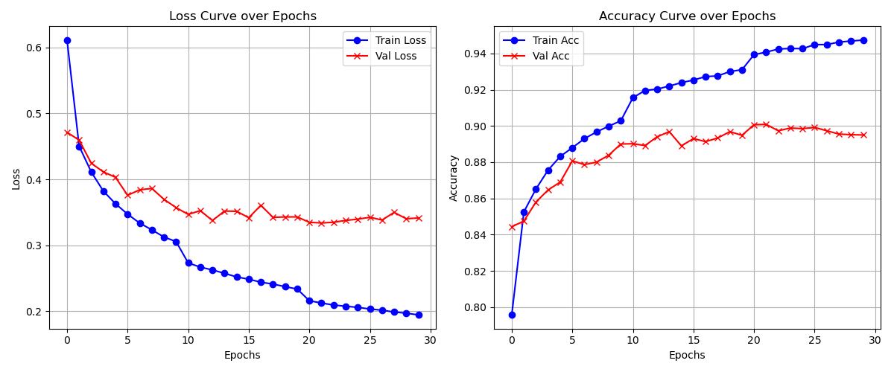
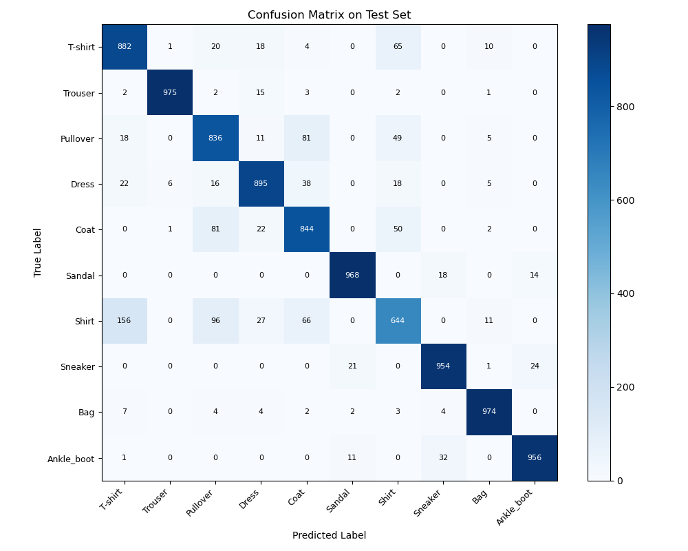
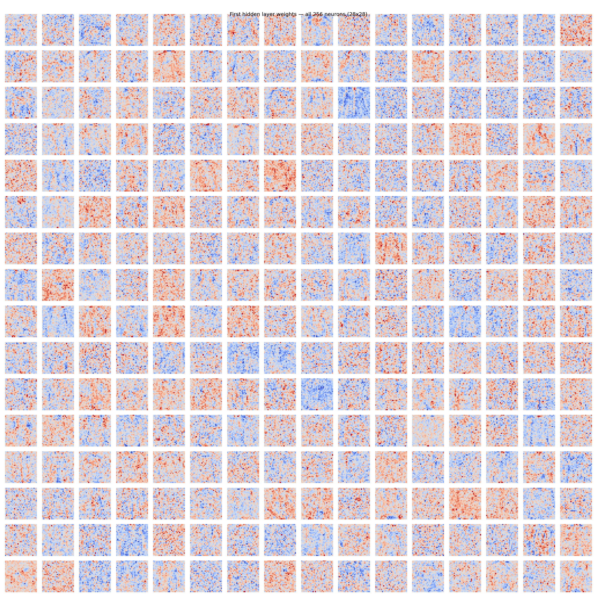
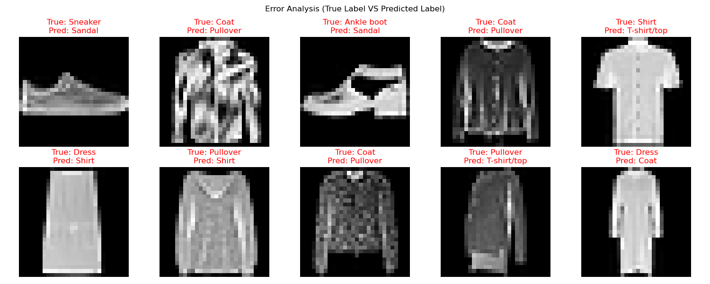
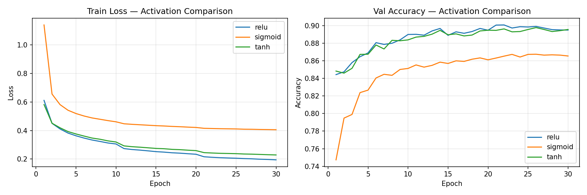

# 计算机视觉 作业一 实验报告

**课程**：计算机视觉 | **项目**：从零构建三层 MLP 实现 Fashion-MNIST 分类

- **GitHub**：[填写链接]
- **模型权重（Google Drive）**：[填写链接]

---

## 一、数据集与预处理

Fashion-MNIST 包含 10 类服装灰度图像，每张 $28\times28$，共 70,000 张（训练 60,000 + 测试 10,000）。

预处理步骤：
1. 解析原生 `idx-ubyte` 格式，提取图像与标签。
2. 像素归一化：$[0,255]\rightarrow[0,1]$。
3. 展平为 $(N,784)$ 向量，适配全连接网络。
4. 训练集按 9:1 切分出 54,000 训练 / 6,000 验证，测试集（10,000）仅用于最终评估。

---

## 二、模型与代码实现

### 2.1 模型结构

三层 MLP，隐藏层大小由 `hidden_dims` 参数控制，激活函数支持 ReLU / Sigmoid / Tanh 切换：

```
输入层      784 维
隐藏层一    Linear(784 → 256) → ReLU
隐藏层二    Linear(256 → 128) → ReLU
输出层      Linear(128 → 10)  → Softmax + 交叉熵
```

| 层 | 权重形状 | 参数量 |
|----|----------|--------|
| Linear 1 | (784, 256) + (256,) | 201,216 |
| Linear 2 | (256, 128) + (128,) | 32,896 |
| Linear 3 | (128, 10) + (10,) | 1,290 |
| **合计** | | **235,402** |

权重使用 Kaiming 初始化：$W \sim \mathcal{N}(0,\sqrt{2/\text{fan\_in}})$。

### 2.2 反向传播（纯 NumPy 实现）

不使用任何自动微分框架，每个层手动实现 `forward` / `backward`：

```python
# neural_network/layers.py
class Linear(Layer):
    def forward(self, x):
        self.cache = x
        return np.dot(x, self.params['W']) + self.params['b']

    def backward(self, dout):
        x = self.cache
        self.grads['W'] = np.dot(x.T, dout)
        self.grads['b'] = np.sum(dout, axis=0)
        return np.dot(dout, self.params['W'].T)
```

### 2.3 损失函数

Softmax 与交叉熵融合，先减最大值保证数值稳定：

```python
# neural_network/losses.py
def forward(self, logits, y_true):
    shifted = logits - np.max(logits, axis=1, keepdims=True)
    probs = np.exp(shifted) / np.sum(np.exp(shifted), axis=1, keepdims=True)
    return -np.mean(np.log(probs[range(len(y_true)), y_true] + 1e-8))
```

### 2.4 优化器：SGD + L2 正则 + 学习率衰减

```python
# neural_network/optimizer.py
# SGD with L2
grad += self.weight_decay * layer.params[key]  # L2 梯度项
layer.params[key] -= self.lr * grad

# StepLR：每 step_size 个 epoch 学习率乘以 gamma
if self.last_epoch % self.step_size == 0:
    self.optimizer.lr *= self.gamma
```

### 2.5 验证集自动保存最优权重

```python
# train.py
if val_acc_avg > best_val_acc:
    best_val_acc = val_acc_avg
    model.save_weights(save_path)
```

---

## 三、超参数网格搜索

对学习率、隐藏层大小、正则化强度各设两个候选值，共 8 组，每组训练 15 epochs，以验证集峰值准确率评选：

```python
search_space = {
    'lr':           [0.1, 0.05],
    'hidden_dims':  [[128, 64], [256, 128]],
    'weight_decay': [1e-4, 1e-3],
}
```

| lr | hidden_dims | weight_decay | val_acc |
|----|-------------|--------------|---------|
| 0.1 | [128, 64] | 1e-4 | 0.8928 |
| 0.1 | [128, 64] | 1e-3 | 0.8918 |
| **0.1** | **[256, 128]** | **1e-4** | **0.8968 ✓** |
| 0.1 | [256, 128] | 1e-3 | 0.8930 |
| 0.05 | [128, 64] | 1e-4 | 0.8918 |
| 0.05 | [128, 64] | 1e-3 | 0.8888 |
| 0.05 | [256, 128] | 1e-4 | 0.8925 |
| 0.05 | [256, 128] | 1e-3 | 0.8893 |

**最优参数**：`lr=0.1, hidden_dims=[256,128], weight_decay=1e-4`（验证集准确率 89.68%）。规律：更大学习率、更宽网络、较弱正则在三个维度上均取得最优。

---

## 四、训练与评估

用最优参数完整训练 30 epochs（StepLR 在第 10、20 epoch 衰减）。

### 4.1 训练曲线



- **Loss**：Train Loss 从 0.60 快速下降，第 10、20 epoch 学习率衰减后出现两次加速，最终收敛至约 0.25。Val Loss 稳定在 0.30～0.35，L2 正则有效抑制过拟合。
- **Accuracy**：Val Acc 前 10 epoch 爬升至约 0.88，之后趋于平稳，最终收敛约 0.90。

### 4.2 测试集结果

**测试集准确率：89.28%**

### 4.3 混淆矩阵



| 类别 | 正确数 | 准确率 | 主要混淆 |
|------|--------|--------|---------|
| T-shirt/top | 882 | 88.2% | → Shirt (65) |
| Trouser | 975 | 97.5% | — |
| Pullover | 836 | 83.6% | → Coat (81), → Shirt (49) |
| Dress | 895 | 89.5% | → Coat (38) |
| Coat | 844 | 84.4% | → Pullover (81), → Shirt (50) |
| Sandal | 968 | 96.8% | → Sneaker (18) |
| **Shirt** | **644** | **64.4%** | → T-shirt (156), → Pullover (96), → Coat (66) |
| Sneaker | 954 | 95.4% | → Ankle_boot (24) |
| Bag | 974 | 97.4% | — |
| Ankle_boot | 956 | 95.6% | → Sneaker (32) |

Shirt 准确率最低（64.4%），上装五类之间大量双向误判；Trouser、Bag、鞋类形态独特，准确率均 ≥ 95%。

### 4.4 第一层权重可视化

将 $W^{(1)}\in\mathbb{R}^{784\times256}$ 的全部 256 个神经元权重各自恢复为 $28\times28$ 图像：



大多数神经元权重呈高频噪声纹理，这是全连接层无局部感受野约束的固有现象；少数神经元可见以中央为核心的大范围渐变（对应服装主体居中的全局亮度）及隐约的对称条带结构，但特征远不如 CNN 清晰可解释。

### 4.5 错例分析



| # | 真实 | 预测 |
|---|------|------|
| 1 | Sneaker | Sandal |
| 2 | Coat | Pullover |
| 3 | Ankle boot | Sandal |
| 4 | Coat | Pullover |
| 5 | Shirt | T-shirt/top |
| 6 | Dress | Shirt |
| 7 | Pullover | Shirt |
| 8 | Coat | Pullover |
| 9 | Pullover | T-shirt/top |
| 10 | Dress | Coat |

错误原因归纳：
1. **上装轮廓混淆**（错例 2/4/5/7/8/9）：Coat、Pullover、Shirt 在 28×28 分辨率下整体轮廓高度相似，领口、纽扣等区分性细节难以分辨。
2. **鞋类镂空干扰**（错例 1/3）：运动鞋/踝靴侧面大面积暗色区域与凉鞋绑带开口特征相似，被误判为 Sandal。
3. **纵向比例混淆**（错例 6/10）：无袖直筒连衣裙上半身轮廓与衬衫重合；长款连衣裙廓形与长款外套重叠。

---

## 五、激活函数对照实验

固定最优超参数，分别以 ReLU / Sigmoid / Tanh 训练 30 epochs：



| 激活函数 | 验证集最高准确率 |
|----------|-----------------|
| **ReLU** | **0.9008** ✓ |
| Tanh | 0.8978 |
| Sigmoid | 0.8675 |

- **ReLU**：收敛最快，单侧线性梯度无饱和区，梯度传播畅通，准确率最高。
- **Tanh**：收敛速度与 ReLU 相近，零中心化输出对梯度方向有所帮助，准确率仅低 0.3 个百分点。
- **Sigmoid**：初始 Loss 高达 1.14（ReLU/Tanh 约 0.58），两端饱和区导致梯度消失，收敛明显偏慢，最终准确率低约 3.3 个百分点。
